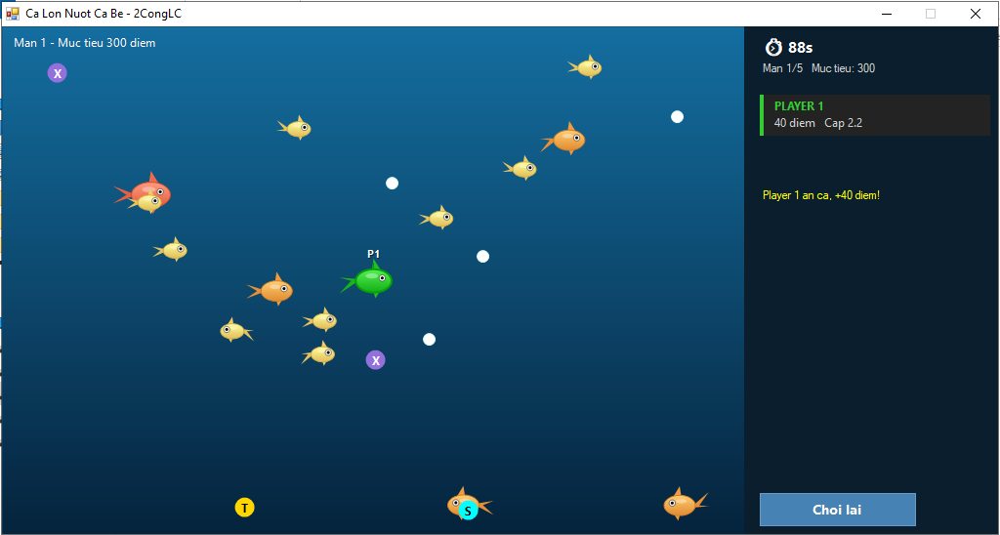

# Cá Lớn Nuốt Cá Bé

<p align="center">
  
</p>

Trò chơi cá lớn nuốt cá bé — điều khiển con cá của mình bơi trong ao, ăn
các con nhỏ hơn để lớn dần và gom điểm. Hỗ trợ chơi đơn (5 màn) hoặc
PvP 2 người qua mạng LAN/Online.

# Các tính năng chính
- **Chơi đơn** 5 màn, độ khó tăng dần — cá AI to hơn và nhiều hơn ở màn cao
- **PvP 2 người** qua mạng LAN/Online — cá lớn hơn có thể nuốt người chơi kia
- Tính điểm thời gian thực, đếm ngược thời gian mỗi màn
- Kích thước cá tăng dần khi ăn, giảm khi bị ăn hoặc chạm rong độc
- Các vật phẩm đặc biệt xuất hiện ngẫu nhiên trong ao
- Cá AI bơi ngẫu nhiên, đổi hướng liên tục, nảy tường khi chạm viền

# Vật phẩm trong ao
| Vật phẩm | Hiệu ứng |
|----------|----------|
| 🟡 Ngọc trai | +80 điểm |
| 🟣 Rong độc | Bị thu nhỏ lại |
| 🕐 Đồng hồ | +10 giây thời gian |
| ⚡ Tia chớp | Tăng tốc độ bơi tạm thời |

# Hệ thống điểm & kích thước
| Hành động | Điểm | Kích thước |
|-----------|------|------------|
| Ăn cá AI | +40 × cỡ cá | Tăng nhẹ |
| Bị cá AI ăn | -30 điểm | Thu nhỏ, hồi sinh |
| Ăn ngọc trai | +80 điểm | Không đổi |
| Ăn rong độc | Không đổi | Thu nhỏ |
| Nuốt người chơi kia (PvP) | +100 ~ +300 điểm | +1.0 |
| Bị nuốt (PvP) | -50 điểm | -2.0, hồi sinh |

# Điều kiện thắng (chơi đơn)
| Màn | Điểm mục tiêu | Thời gian |
|-----|--------------|-----------|
| 1 | 300 | 90 giây |
| 2 | 500 | 80 giây |
| 3 | 800 | 70 giây |
| 4 | 1150 | 65 giây |
| 5 | 1550 | 60 giây |

Đạt đủ điểm trước khi hết giờ → lên màn tiếp theo (giữ nguyên điểm và kích thước).
Hoàn thành màn 5 → **Chiến thắng**. Hết giờ → kết thúc, tính điểm cuối.

**PvP:** Hết giờ → ai nhiều điểm hơn thắng. Hòa nếu bằng điểm.

# Điều khiển
| Người chơi | Di chuyển |
|------------|-----------|
| Player 1 (Host) | W A S D |
| Player 2 (Client) | ↑ ↓ ← → |

# Cách build
Yêu cầu: **.NET Framework 4.x** đã cài sẵn trên Windows.

```
build_calon.bat
```

File `.exe` xuất ra cùng thư mục với tên `CaLonNuotCaBe.exe`.

# Cách chơi

**Chơi đơn:**
1. Chọn **Chơi 1 người** → bắt đầu ngay từ màn 1
2. Dùng WASD bơi, ăn cá nhỏ hơn để lớn và gom điểm
3. Đạt đủ điểm mục tiêu trước khi hết giờ để lên màn

**PvP LAN:**
1. Máy Host chọn **Tạo phòng** → chờ kết nối
2. Máy Client chọn **Vào phòng** → nhập IP của Host → kết nối
3. Game bắt đầu khi cả 2 đã vào phòng

# Cấu trúc file
| File | Vai trò |
|------|---------|
| `FishGame.vb` | Logic game: ao cá, di chuyển, va chạm, vật phẩm, điểm, màn chơi |
| `FishForm.vb` | Giao diện, vẽ ao cá, điều khiển, kết nối mạng |
| `NetworkPeer.vb` | Kết nối mạng TCP giữa Host và Client |
| `ProgramFish.vb` | Entry point |
| `build_calon.bat` | Script build bằng vbc.exe |
